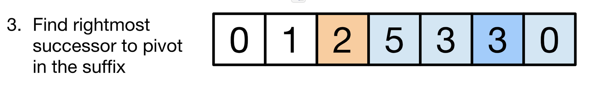

31 Next Permutation

*link*: https://leetcode.com/problems/next-permutation/

```python
class Solution:
    def nextPermutation(self, nums: List[int]) -> None:
        """
        Do not return anything, modify nums in-place instead.
        """
        # find the pivot which nums[i + 1] > nums[i]
        i = len(nums) - 2
        while (i >= 0) and (nums[i+1] <= nums[i]):
            i -= 1
        
        # find the number just larger than nums[i]
        j = i
        while (j + 1 < len(nums)) and (nums[j+1] > nums[i]):
            j += 1
        
        # swap nums[i] and nums[j]
        if i >= 0 and j >= 0:
            nums[i], nums[j] = nums[j], nums[i]
        
        # reverse the right part of nums[i]
        start = i + 1
        end = len(nums) - 1
        while start < end:
            nums[start], nums[end] = nums[end], nums[start]
            start += 1
            end -= 1
```

### Explanation:
As the picture illusttrated by [TWiStErRob](https://leetcode.com/problems/next-permutation/discuss/13994/Readable-code-without-confusing-ij-and-with-explanation).

#### Step 1: Find the pivot pivot which nums[i + 1] > nums[i]


#### Step 2: Find the number just larger than nums[i] (pivot in Step 1)


#### Step 3: Swap nums[i] (pivot in Step 1) and nums[j] (the number in Step 2)


#### Step 4: Reverse the part right after the pivot.


### Time Complexity
$$ O(n) $$

### Space Complexity
$$ O(1)$$

### Other solution or reference
1. Shared by [TWiStErRob](https://leetcode.com/problems/next-permutation/discuss/13994/Readable-code-without-confusing-ij-and-with-explanation)

